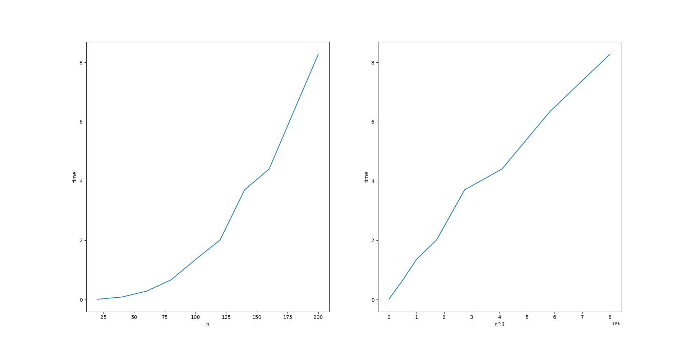

# 概要
サイズnの2つの行列の積を求めるのに必要な実行時間を計測し、nとの関係をグラフにプロットした。

# 実装・計算方法
nは20から200まで20刻みに動かし、各nについて、サイズnの3つの正方行列A,B,Cを用意して、AとBの積を求め、Cに代入した。

AとBの積は、Aの(i,j)成分を a\[i,j\] 、Bの(i,j)成分をb\[i,j\]として

と表され、これは時間計算量O(n^3)で計算できる。それが正しいことを確かめるため、matplotlib.pyplotを用いて、左側にnと時間との関係、右側にn^3と時間との関係をプロットした。

# 実行結果
以下のようになった。

右側のグラフはほぼ直線になっているため、確かに行列積の計算時間はn^3に比例すると確認できる。
