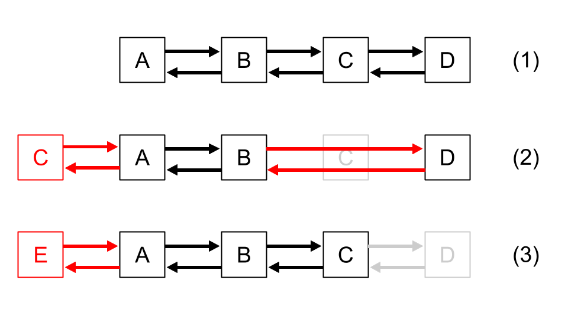

# 概要
ハッシュテーブルと双方向リストを組み合わせることでキャッシュの更新をO(1)で実現するデータ構造を実装した。

# データ構造
各URLについて、
* 対応するwebページの内容 (webpages\[URL\])
* その直前に閲覧したサイトのURL (before\[URL\])
* その直後に閲覧したサイトのURL (after\[URL\])

を保持しておく。これらは、URLをキーとするハッシュテーブルとして保持されているため、O(1)時間でアクセスできる。キャッシュ内の2つの連続する要素A,Bは

* after\[A\] = B
* before\[B\] = A

として連結される。

また、キャッシュのうち最新、最古のもののURLもnewest_url, oldest_urlとして保持しておく。これらは、それぞれ以下の目的のために必要である。

* newest_url: キャッシュにページを追加するとき、最新のものと連結するため
* oldest_url: キャッシュがあふれそうなとき、最も古いものを削除するため

これにより、例えばD,C,B,Aという4つのサイトをこの順にアクセスした場合には、下図(1)のような双方向リストが形成されている。

新たにwebページPにアクセスした際には、以下のような処理を行う。
* Pがすでにキャッシュに含まれる場合: それを削除したうえで、改めてPを先頭に追加する(図(2))
* 含まれない場合: Pを先頭に追加する。もしキャッシュの要素数がNを上回れば、もっとも古いページを削除する。(図(3))

キャッシュへの追加・削除は以下の方法でO(1)時間で処理できるため、上記の処理はO(1)時間で実現可能である。

## キャッシュへの追加
キャッシュにwebページを追加したうえで、追加したページをそれまで最新だったページ(newest_url)と連結する。

## キャッシュからの削除
削除するウェブページの前後の連結をつなぎ変える。たとえば、"B-C-D"という並びにおいてCを削除する場合には、BとDを互いに連結する。そのうえで、キャッシュからwebページを削除する。

# 実装
* 授業で提示されたサンプルコード(https://github.com/xharaken/step2/blob/master/cache.py)をもとに実装した。
* ハッシュテーブルには、Pythonのdict型を用いた。
* キャッシュへの追加・削除はそれぞれadd, remove関数として実装した。
* キャッシュからの削除は、削除する要素がキャッシュの中で先頭、末尾、それ以外の場合で場合分けして行った。
* キャッシュに新たに追加する要素がすでにキャッシュの先頭にある場合、本来何も処理はしなくてよいが、プログラムの可読性を高めるため、他の場合と同様の処理をしている。