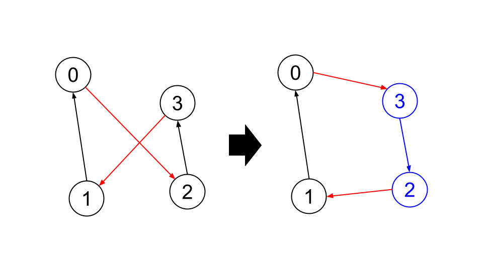

# Google STEP Week5 Homework
## 概要
Traveling Salesperson Problemを解くプログラムを作成しました。初めに、現在いる町から最短の道のりで2つ先の町まで行く」ことを貪欲的に繰り返すことで暫定のルートを求め、そのルートについて、「交差している二辺があったら交差をほどく」ことを繰り返すことで、最善のルートを探しました。

## 実行方法
solver.cpp, utils.cpp, utils.hppと入出力ファイルはは同一ディレクトリ内に置く必要があります。
```
g++ solver.cpp -o solver.exe
```
でコンパイルをしたのち、以下のコマンドでexeファイルを実行してください。
```
solver.exe (input_file_name) (output_file_name)
```

## 出力
`Score(greedy)`: 貪欲法のみで得られたルートのスコア  
`Score`: 交差をほどくことで改善したルートのスコア

## 実行結果
得られたスコアは以下のようになった。
|   |Score(greedy)|Score|
|---|---|---|
|N=5|3418.1|3418.1|
|N=8|4428.09|3778.72|
|N=16|6097.87|4494.42|
|N=64|10625.4|8499.15|
|N=128|14896.3|11766.8|
|N=512|28646.5|22091.3|
|N=2048|57654.8|43949.4|

## アルゴリズム
### 2つ先までの貪欲法
深さ優先探索で2個先までのルートをすべて列挙し、その中からスコアが最善のものを探します。

### 交差部分を探す
二辺をランダムに選び、その二辺が交差しているかを調べ、もし交差している場合にはその交差がなくなるようにルートを組み替えるということを繰り返しています。

たとえば、下図の左のようなルートで、赤い二辺を選んだ場合を考えます。また、この二辺を組み替えた右側のようなルートを考えます。このとき、

(右側のルートにおける赤い二辺の長さの和) < (左側のルートにおける赤い二辺の長さの和)

であれば、左側のルートにおいて赤い二辺は交差しているということであり、交差がなくなるように(=右側のように)組み替えることで、ルートの長さを短くすることができます。組み替えるにあたっては、青い部分のルートを逆順にすればよいです。

一方左側の方が長さが短ければ、赤い二辺は交差していないので、組み替える必要はありません。



この処理は、反復回数は指定せず、300秒間で反復できるだけ行っています(そのため、実行環境によってスコアが変わるかもしれません)。

## 実装の工夫
* 一つのファイルだと長くなったため、ファイルの入出力などアルゴリズムの本質に関係ない部分はutils.hpp, utils.cppとして別ファイルにした。
* 時間・空間計算量を減らすため引数はすべて参照渡しとしています。その代わり、constをつけて関数内で引数の値を変えられないようにしています。

## その他疑問点など
* テストケースを作るのが難しかったです。得られるのが必ずしも最善のルートとは限らないので、「スコアが正しく計算できているか」「全ての頂点をちょうど一度ずつ訪れているか」「交差をほどくことで確かにスコアが改善しているか」の確認くらいしかできていません。これだけだと不十分な気がしているのですが、他にどのようなテストケースの作り方があるでしょうか。
    * また、その結果としてテストが各関数内に散逸してしまったので、可読性が良くない気がしているのですが、これも改善策はあるでしょうか。
* 2つ先までの貪欲法だと、交差部分の処理前は通常の貪欲法よりスコアが悪いのですが、交差部分を処理して改善すると、通常の貪欲法より良い出力が得られることが多かったので、こちらの方法を採用しました。理由はよく分かりません。