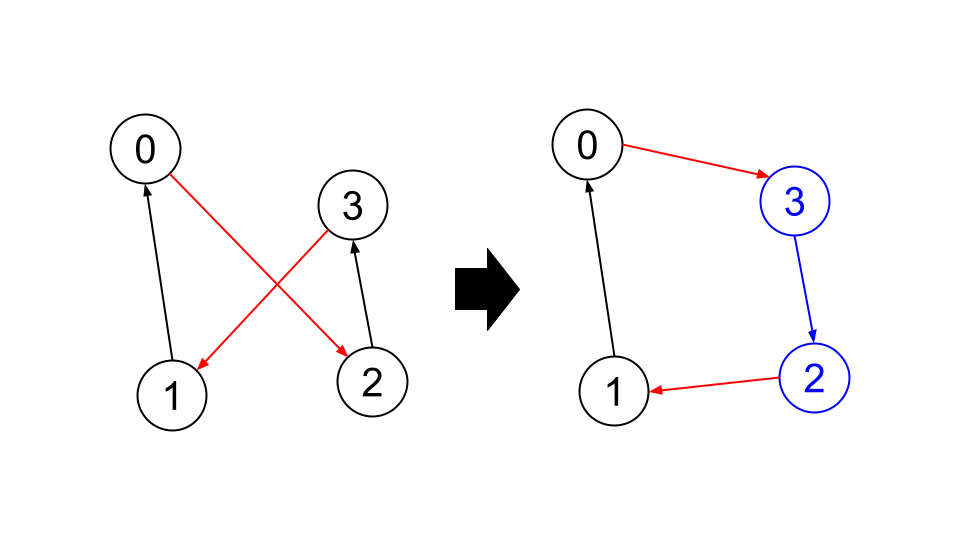

# Google STEP Week7 Homework
## 概要
TSPを解くアルゴリズムを作成した。初めに貪欲法で暫定的な経路を定めたあと、two-opt法、ついで部分列を切り取って違う箇所に付ける処理を繰り返すことで、最善の経路を求めた。部分列を付け替える処理には、焼きなまし法も併せて用いた。

## アルゴリズム
### 初期経路
少しでも良い初期経路を求めるため、複数のスタート地点から以下の処理を行って経路を求め、最短の経路が得られた地点をスタート地点とした。

1. 貪欲法で経路を求める
2. 1.で求めたルートで2秒間two-opt法を行う

2.の処理を入れたのは、貪欲法で最短だったルートがtwo-opt法の適用後に必ずしも最短となるとは限らないからである。

### two-opt法
二辺をランダムに選び、その二辺が交差しているかを調べ、もし交差している場合にはその交差がなくなるようにルートを組み替えるということを繰り返す。

たとえば、下図の左のようなルートで、赤い二辺を選んだ場合を考える。また、この二辺を組み替えた右側のようなルートを考える。このとき、

(右側のルートにおける赤い二辺の長さの和) < (左側のルートにおける赤い二辺の長さの和)

であれば、左側のルートにおいて赤い二辺は交差しているということであり、交差がなくなるように(=右側のように)組み替えることで、ルートの長さを短くすることができる。組み替えるにあたっては、青い部分のルートを逆順にすればよい。

一方左側の方が長さが短ければ、赤い二辺は交差していないので、組み替える必要はない。



この処理は、反復回数は指定せず、一定時間内で反復できるだけ行っている。

### 部分列の組み替え
前回の宿題(Week5)のときの[Hinako Katafuchiさん](https://gist.github.com/chikochan/0e4312c08aca4bdd44586a4914fce878)のプログラムを参考にした。

1. 部分列の始点終点をランダムに選び、部分列subsequenceと残りの経路main_tourに分ける
2. main_tourのとある位置に(そのままの向きで、または反転して)subsequenceを挿入した場合に、どの程度スコアが改善するかを計算する。
3. 2.で計算したスコアの差分から、焼きなまし法でsubsequenceを挿入するかを判定する。
4. 挿入したらまた別のsubsequenceについて1.~を繰り返す。挿入しなかった場合は、挿入する位置を変えて2.~を繰り返す

この処理を一定時間内で可能なだけ反復した。

### 焼きなまし法
上の部分列の組み替え処理は焼きなまし法により行っている。

* 温度はstart_tempからend_tempまで、時間が経つにつれ線型に変化する。
* 温度をtemp, 組み換えを行った場合のスコアの変化量をscore_diffとしたとき、組み替えはexp(-score_diff / temp)の確率で起こる。

初めのうちは、組み替えによってスコアが悪化する場合でも組み替えが頻繁に起こるが、時間が経つにつれてその頻度は下がっていく。


## 実行方法
solver.cpp, utils.cpp, utils.hppと入出力ファイルは同一ディレクトリ内に置く必要がある。
```
g++ -o solver.exe -O3 utils.cpp solver.cpp
```
でコンパイルをしたのち、以下のコマンドでexeファイルを実行する。
```
solver.exe (input_file_name) (output_file_name)
```

## 結果
input_6, input_7についてのみ行った。

### input_6.csv (2048 cities)
two-opt: 5 sec.
move 1800 sec.
start_temp = 2.75
end_temp = 0.05

としたところ、

Score(greedy): 48637.1
Score(two-opt): 41946.9
Score(final): 40687.9


### input_7.csv (8192 cities)
two-opt: 120 sec.
move 7200 sec.
start_temp = 1.75
end_temp = 0.05

としたところ、

Score(greedy): 95983.3
Score(two-opt): 84636
Score(final): 83887.9

となった。

## 実装の工夫
* vectorのコピーの回数を減らすため、可能な限りすべて参照渡し・参照返しをしている。

* 可読性を上げるため、前回と共通のtwo-opt法の部分もさらに細かくモジュール化を行った。

## 考察・感想など
* 部分列の移動を導入した効果は予想以上に絶大だった。input_6に関しては、それだけで40800台までスコアが改善した。

* 一方、焼きなまし法に関しては思ったほどの効果はなかった。また、焼きなまし法を用いる場合、かなり時間をかけて行わないと効果がないどころか却ってスコアが悪化してしまうこともあると分かった。input_7でtwo-opt -> finalのスコアがほとんど改善していないのは時間が短すぎたことが一因だと思われる(かといってこれ以上長時間やるのも難しかったので諦めた)。

* 焼きなまし法の温度関数は、1次関数だけでなく指数関数も試したがあまりうまくいっていない。

* input_7の方に関しては焼きなまし法ではなく、全く別のアプローチを取る方が良かったかもしれない。

* two-opt法にも焼きなまし法を導入すればもう少し改善したかもしれない。あとは部分列移動とtwo-optを交互に行う、などの工夫もできたと思う。

* 初期値ももう少し改善したかったが、Convex Hullはあまりにも難しそうで諦めた。
